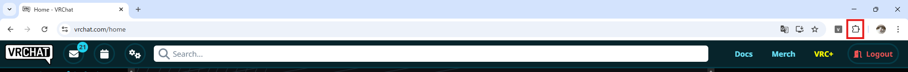
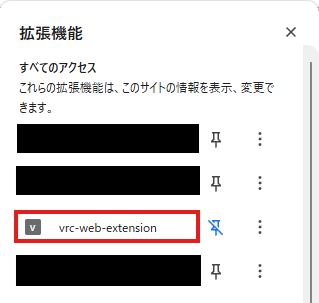
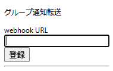

# 使い方
1. 以下のページを参考にウェブフックURLを取得
  - [GameWith：【Discord】ウェブフックの作り方と作成できないときの対処方法【ディスコード】](https://gamewith.jp/discord/458325)
2. [https://vrchat.com/home](https://vrchat.com/home)を開く
  - ログインしていない場合は、ログインしてください
3. 以下のボタンから拡張機能一覧を開く  

4. インストールした拡張機能をクリック  

5. 以下のポップアップが表示されるので、1で取得したウェブフックURLを欄に貼り付けて「保存」をクリック  

6. Discordに「登録が完了しました。」とメッセージが届いていれば完了です。